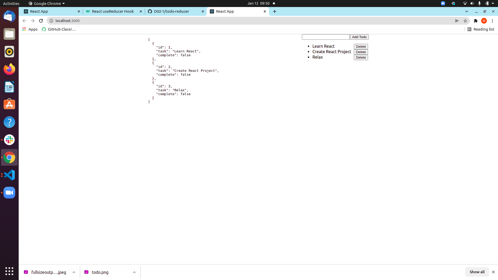

## Todo App with useReducer

### Task

Create a todo app with useReducer

- the user should be able to add and delete todo's
- please use useReducer hook from React

### Bonus

- add mark complete functionality, todo will be crossed-out when marked as completed

